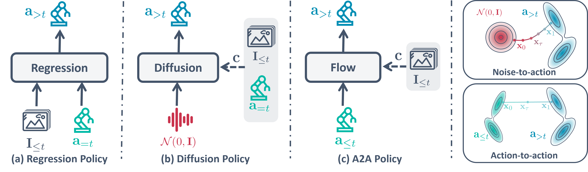
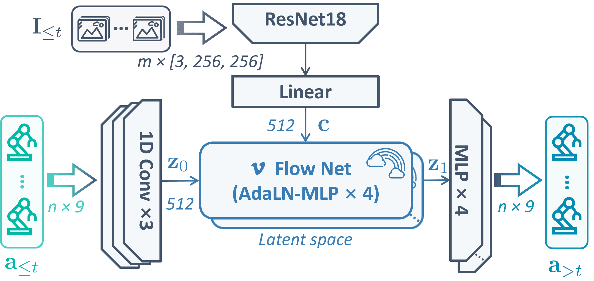

# A2A: Action-to-Action Flow Matching Policy

A2A is a flow matching policy that directly transforms history action distributions to future action distributions, conditioned on visual observations. This repository provides the implementation of A2A algorithm built on top of the [RoboVerse](https://github.com/RoboVerseOrg/RoboVerse) platform.

<p align="center">
  
</p>

## Overview

A2A (Action-to-Action) uses flow matching to learn a transformation from history states to future actions, enabling efficient and robust imitation learning for robotic manipulation tasks. 
Paper link: https://arxiv.org/pdf/2602.07322


### Architecture

```
History States [s_{t-n+1}, ..., s_t] --encode--> history_latents (x_0)
Visual Obs [img_{t-n+1}, ..., img_t] --encode--> obs_latents (condition)

Flow Matching: x_0 --flow(condition)--> x_1 (future_action_latents)

x_1 --decode--> Future Actions [a_t, a_{t+1}, ..., a_{t+k}]
```
<p align="center">
  
</p>

### Variants

| Policy | Description |
|--------|-------------|
| `a2a` | Base Action-to-Action flow matching policy |
| `a2a_noise` | Adds Gaussian noise to history actions for improved robustness |

## Installation

### Prerequisites

This project is built on [RoboVerse](https://github.com/RoboVerseOrg/RoboVerse). Please follow the RoboVerse documentation for environment setup:

1. **Create Conda Environment**
   
   Please refer to the [RoboVerse Documentation](https://roboverse.wiki/metasim/) for detailed installation instructions.

2. **Install Simulators**
   
   A2A supports multiple simulators. Install the ones you need:
   
   - **Isaac Sim V5.0.0**: Follow [Isaac Sim Installation Guide](https://roboverse.wiki/metasim/get_started/installation)
   - **MuJoCo**: Follow [MuJoCo Installation Guide](https://roboverse.wiki/metasim/get_started/installation)

3. **Install A2A Dependencies**

   ```bash
   cd roboverse_learn/il/policies/a2a
   pip install -r requirements.txt
   ```

4. **Fix Potential Issues (Optional)**
   
   If you encounter issues with zarr or hydra, run the setup script to fix them:
   
   ```bash
   bash roboverse_learn/il/il_setup.sh
   ```

5. **Setup Weights & Biases (Optional)**
   
   Create a [Weights & Biases](https://wandb.ai/) account to obtain an API key for experiment logging.

## Quick Start

### 1. Collect Demonstration Data

```bash
bash roboverse_learn/il/collect_demo.sh
```

### 2. Train A2A Policy

```bash
bash roboverse_learn/il/il_run.sh \
    --task_name_set close_box \
    --policy_name a2a \
    --train_enable True \
    --eval_enable False
```

### 3. Evaluate A2A Policy

```bash
bash roboverse_learn/il/il_run.sh \
    --task_name_set close_box \
    --policy_name a2a \
    --train_enable False \
    --eval_enable True
```

## Usage

### Command Line Parameters

| Parameter | Default | Description |
|-----------|---------|-------------|
| `--task_name_set` | `close_box` | Task name (e.g., `close_box`, `stack_cube`, `pick_cube`) |
| `--policy_name` | `a2a` | Policy type (`a2a`, `a2a_noise`) |
| `--sim_set` | `isaacsim` | Simulator (`isaacsim`, `mujoco`) |
| `--demo_num` | `100` | Number of demonstrations |
| `--train_enable` | `True` | Enable training |
| `--eval_enable` | `True` | Enable evaluation |
| `--num_epochs` | `200` | Number of training epochs |
| `--gpu` | `0` | GPU device ID |
| `--dr_level_collect` | `0` | Domain randomization level for data collection |
| `--dr_level_eval` | `0` | Domain randomization level for evaluation |

### Examples

**Train A2A on stack_cube task with Issac Sim:**
```bash
bash roboverse_learn/il/il_run.sh \
    --task_name_set stack_cube \
    --policy_name a2a \
    --sim_set isaacsim \
    --num_epochs 300 \
    --gpu 0
```

**Evaluate with domain randomization:**
```bash
bash roboverse_learn/il/il_run.sh \
    --task_name_set close_box \
    --policy_name a2a \
    --train_enable False \
    --eval_enable True \
    --dr_level_eval 2
```

## Project Structure

```
├── roboverse_learn/
│   └── il/
│       ├── il_run.sh              # Main training/evaluation script
│       ├── collect_demo.sh        # Demo collection script
│       ├── train.py               # Training entry point
│       ├── configs/               # Hydra configuration files
│       │   └── policy_config/
│       │       ├── a2a.yaml       # A2A policy config
│       │       └── a2a_noise.yaml # A2A-Noise policy config
│       └── policies/
│           └── a2a/               # A2A policy implementation
│               ├── a2a_policy.py
│               ├── a2a_noise_policy.py
│               ├── action_ae.py
│               └── README.md
├── data_policy/                   # Collected demonstration data
└── il_outputs/                    # Training outputs and checkpoints
```

## Checkpoints

Trained model checkpoints are saved at:
```
./il_outputs/{policy_name}/{task_name}/checkpoints/{epoch}.ckpt
```

## Supported Tasks

The following tasks from RoboVerse are supported:

- `close_box`
- `stack_cube`
- `pick_cube`
- And more tasks from RoboVerse...

Please refer to [RoboVerse Documentation](https://roboverse.wiki/) for the complete list of available tasks.

## Real-Robot Deployment

Deploying A2A on a real robot involves additional considerations beyond simulation. The following notes summarize practices we have validated and recommend for a smooth real-world setup.

### Prerequisites

Before moving to real-robot experiments, we **strongly recommend** the following progression:

1. **Reproduce simulation results first.** Make sure you can reproduce A2A's advantage over baselines reported in the paper within simulation. This validates your training pipeline and gives you a reference point for debugging real-world issues.
2. **Get Diffusion Policy working on the real robot before A2A.** DP serves as a sanity check for your data collection, observation pipeline, and low-level controller. Once DP runs reliably, switching to A2A is straightforward.

### Recommended Setup

- **Develop your real-robot API on top of this repo.** Porting A2A to a different codebase tends to introduce subtle bugs (action normalization, observation alignment, history buffering). Staying within this repo and adding a real-robot interface is the path of least resistance.
- **Robot arm: Franka is recommended.** We have thoroughly validated A2A on Franka and the integration is essentially plug-and-play. Other arms are supported in principle, but expect some debugging effort around the control interface and others.

### Key Implementation Notes

- **Prefer continuous action signals.** A2A is grounded in the physical continuity of actions, which makes it most effective for tasks dominated by smooth, continuous control signals. For discrete or switch-like action dimensions (e.g., binary gripper open/close commands), this continuity prior provides limited benefit. Consider handling such dimensions with a separate head or post-processing.

- **Use *executed* actions as the flow source, not commanded actions.**

  > To enhance closed-loop robustness, the flow source should be the history of **executed** actions inferred from proprioceptive feedback, rather than the actions previously commanded by the policy. This accounts for imperfect low-level tracking and prevents compounding errors at deployment time.

- **Add small Gaussian noise to history actions during training.** This improves robustness and preserves multi-modality of the learned distribution. We recommend a standard deviation of **0.02** as a good default.

### Troubleshooting

Real-robot deployment inevitably surfaces setup-specific issues. Don't be discouraged if the first few rollouts behave unexpectedly — iterate, log proprioceptive feedback, and compare against your simulation runs. Feel free to open an issue if you run into problems we can help with.

## License

This project is licensed under the Apache License 2.0.

## Acknowledgments

This project is built on top of [RoboVerse](https://github.com/RoboVerseOrg/RoboVerse). We thank the RoboVerse team for providing an excellent platform for robot learning research.

## Citation

If you find A2A useful in your research, please consider citing:

```bibtex
@inproceedings{a2a2026,
    author={Jia, Jindou and Li, Gen and Chen, Xiangyu and An, Tuo and Hu, Yuxuan and Li, Jingliang and Guo, Xinying and Yang, Jianfei},
    title     = {{A2A: Action-to-Action Flow Matching Policy}},
    booktitle = {Proceedings of Robotics: Science and Systems},
    year      = {2026},
    address   = {Sydney, Australia},
    month     = {July}
}
```

