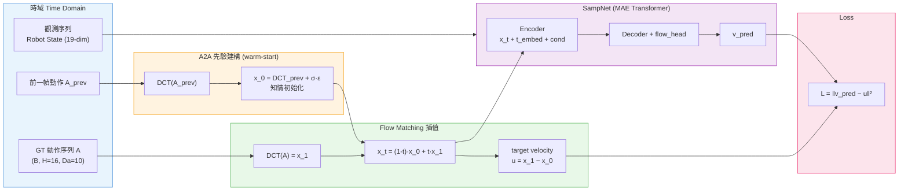
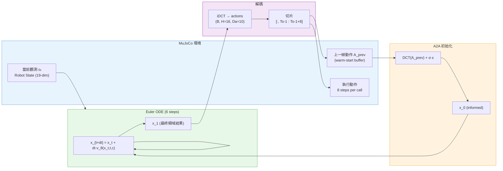

# SAMP-Diff 研究計畫

> 回到使用說明 → [README.md](./README.md)

---

## 文件索引

| 文件 | 說明 |
| :--- | :--- |
| [README.md](./README.md) | 安裝、訓練、評估（使用說明） |
| [PLAN.md](./PLAN.md) | 研究計畫（本頁） |
| [thesis/A2A.md](./thesis/A2A.md) | A2A Flow Matching 深度技術分析 |
| [thesis/DP4.md](./thesis/DP4.md) | Diffusion Policy 4 深度技術分析 |

---

## 1. 專案定位

SAMP-Diff（Spectral-Adaptive Modulated Prior Diffusion）結合三項技術：

| 技術來源 | 整合位置 | 作用 |
| :--- | :--- | :--- |
| **A2A Flow Matching** | 熱啟動先驗 + ODE 去噪 | warm-start 初始化 + 6 步 Euler ODE，取代 50 步標準去噪 |
| **FreqPolicy（主幹）** | Encoder–Decoder + 頻域生成 | DCT 切割頻率、MAE Transformer 編解碼、FM velocity loss |
| **Modulated Prior Diffusion** | 先驗建構 | 以 $A_{t-1}$ 頻域係數作為先驗均值，取代純高斯起點 |

對標技術深度分析：
- [A2A Flow Matching →](./thesis/A2A.md)：知情初始化之效率優勢與時域過度平滑之局限性
- [Diffusion Policy 4 (DP4) →](./thesis/DP4.md)：潛在空間擴散之穩健性及其即時控制運算壓力

---

## 2. 核心創新：頻譜差異化調變

傳統 A2A 在時域對所有頻率一視同仁地做 warm-start，導致高頻細節喪失（過度平滑）。  
SAMP-Diff 提出差異化策略：

$$x_T = [\underbrace{\mu_{low} + \sigma_{low} \odot \epsilon_{low}}_{\text{低頻：歷史記憶熱啟動}},\ \underbrace{\epsilon_{high}}_{\text{高頻：自由雜訊}}]$$

| 成分 | 先驗來源 | 策略 | 效果 |
| :--- | :--- | :--- | :--- |
| **低頻** | $A_{t-1}$ 歷史動作 | A2A warm-start | 維持動作骨架，肌肉記憶 |
| **高頻** | $\mathcal{N}(0,I)$ | 自由雜訊 | 保留對環境的即時反應能力 |

---

## 3. 系統運作閉環

```
┌──────────────────────────────────────────────────────────────────┐
│                        完整控制閉環                               │
│                                                                  │
│   [ 時域 Time Domain ]          [ 頻域 Frequency Domain ]         │
│                                                                  │
│  觀測 oₜ (RGB/Joint)            FFT(Aₜ₋₁)                        │
│       │                         ├─ 低頻 F_low → 熱啟動先驗 xT    │
│  Obs Encoder                    │               (Modulated Prior)│
│       │                         └─ 高頻 F_high → ε ~ N(0,I)      │
│       ▼                                    │                     │
│  條件向量 c ──────────────────────────► FreqPolicy               │
│                                        Encoder-Decoder           │
│  Aₜ₋₁ (歷史動作) ──── FFT ──────────►   (Transformer)            │
│       ▲                                    │                     │
│       │                              迭代去噪 1~3步 (ODE)         │
│  RTDE 50Hz+                               │                      │
│  傳送至 UR 機器人                    IFFT ◄─┘                     │
│       ▲                                    │                     │
│       └──── Aₜ (時域動作序列) ◄────────────┘                      │
└──────────────────────────────────────────────────────────────────┘
```

| 階段 | 發生在 | 操作 | 技術來源 |
| :--- | :--- | :--- | :--- |
| **感知** | 時域 | 讀取 $o_t$、$A_{t-1}$ | — |
| **FFT 轉換** | 時域 → 頻域 | $F = \text{FFT}(A_{t-1})$ | FreqPolicy |
| **先驗建構** | 頻域 | 低頻熱啟動 + 高頻隨機 → $x_T$ | A2A + MPD |
| **頻率分層生成** | 頻域 | Transformer 迭代，k 層 token | FreqPolicy |
| **快速去噪** | 頻域 | 1~3 步 ODE（Flow Matching） | A2A |
| **IFFT 還原** | 頻域 → 時域 | $A_t = \text{IFFT}(C_t)$ | FreqPolicy |
| **執行** | 時域 | RTDE 50Hz+ 控制，$A_t$ 存回 $A_{t-1}$ | — |

---

## 4. v1 現行架構說明

SAMP_Diff_v1 為已落地之第一版。採 **DCT（全頻）** 取代 FFT，**Flow Matching** 取代 DDPM，並加入 **A2A warm-start**。高低頻分離策略留待 v2。

| 項目 | **v1 當前** | **目標 v2** |
| :--- | :--- | :--- |
| 頻率工具 | DCT（全頻一致） | FFT（高 / 低頻分離） |
| 損失函數 | Flow Matching MSE | FM + per-band weighted loss |
| warm-start 先驗 | DCT(A_prev) + σ·ε（全頻） | 低頻 DCT warm-start；高頻 → N(0,I) |
| 推論步數 | 6 步 Euler ODE | 1~3 步 ODE |
| 模擬環境 | MuJoCo (robomimic) | MuJoCo + Real UR |

### 訓練流程圖



### 推論流程圖



---

## 5. 設計哲學

### 解決「延遲」
利用 A2A 知情初始化配合 Modulated Prior，將推論步數壓縮至 **1-6 步**，解決標準 Diffusion 運算過慢之痛點。

### 解決「抖動」
在頻域生成動作等於是在底層進行物理級的「低通濾波」，從數學本質上確保產出軌跡的連貫性與絲滑度。

### 解決「反應遲鈍」
v1 的全頻 warm-start 已解決延遲問題。v2 將實施頻率差異化，低頻保留記憶，高頻恢復自由探索，使機器人兼具肌肉記憶與靈敏反應。

---

## 6. 實驗設計

### Exp-1：頻率先驗的來源應該是什麼？

**研究問題**：不同頻率成分的先驗資訊來源，應該是歷史動作還是即時觀測？

**假說**：低頻跨幀變化緩慢，適合由 $A_{t-1}$ 提供先驗；高頻對應即時修正，適合自由雜訊或觀測引導。

#### 對照策略

| 方案 | 低頻先驗 | 高頻先驗 | 核心概念 |
| :--- | :--- | :--- | :--- |
| **方案 A**（A2A 原版） | $A_{t-1}$ 歷史 | $A_{t-1}$ 歷史 | 全頻靠記憶 |
| **方案 B**（本研究 v1）| $A_{t-1}$ 歷史 | $\mathcal{N}(0,I)$ 自由 | 低頻記憶 / 高頻自由 |
| **方案 C**（v2 候選）| $A_{t-1}$ 歷史 | obs 編碼 $z_t$ | 低頻記憶 / 高頻視覺引導 |

#### 任務情境

- **情境一（慣性主導）**：`Robomimic Lift` — 動作平滑，無突發干擾
- **情境二（視覺主導）**：`PushT` + 目標物隨機位移 — 需要即時修正

#### 評估指標

| 指標 | 說明 |
| :--- | :--- |
| Task Success Rate | 任務完成率 |
| Frequency Band Error | 低頻 / 高頻係數預測 MSE |
| Action Jerk | 平滑度，衡量高頻先驗是否引入抖動 |
| Perturbation Recovery Time | 干擾後幾幀內恢復正確軌跡 |

---

## 7. 基準比較

| 方法 | NFE | Task Success (Lift) | Action Jerk | 50Hz 可行 |
| :--- | :---: | :---: | :---: | :---: |
| Standard DDPM | ~50 | 高 | 中 | ✗ |
| A2A Flow Matching | 1-3 | 中-高 | 中 | ✓ |
| DP4 | ~10 | 最高 | 中 | 邊界 |
| **SAMP-Diff v1** | **6** | TBD | **低（頻域）** | **✓** |
| **SAMP-Diff v2** | **1-3** | TBD | **最低** | **✓** |
