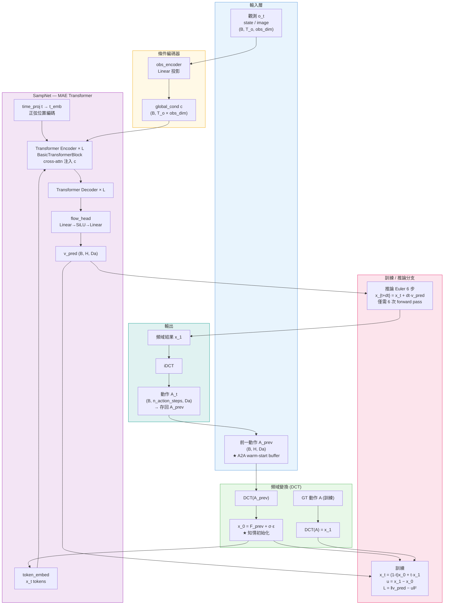
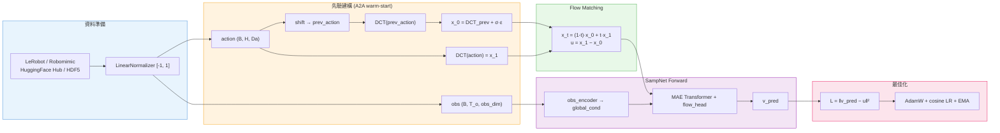
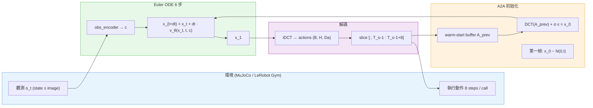

# Spectral-Adaptive Modulated Prior Diffusion (SAMP-Diff)

結合 **A2A 知情初始化**、**頻域（DCT）動作生成** 與 **Flow Matching** 的機器人控制策略。
將動作預測移至頻域，以 6 步 Euler ODE 取代標準 50 步去噪，實現 50Hz+ 即時控制。

---

## 文件索引

| 文件 | 說明 |
| :--- | :--- |
| [Plan.md](./PLAN.md) | 架構概覽、研究計畫、安裝、訓練、評估（本頁） |
| [thesis/A2A.md](./thesis/A2A.md) | A2A Flow Matching 深度技術分析 |
| [thesis/DP4.md](./thesis/DP4.md) | Diffusion Policy 4 深度技術分析 |

---

## 核心創新與技術組合

本研究融合三個技術主幹，缺一不可：

| 技術 | 來源 | 本研究的整合方式 |
| :--- | :--- | :--- |
| **DCT 頻域動作編碼** | FreqPolicy | 所有動作在 DCT 空間生成，降低 token 數量 |
| **A2A 知情熱啟動** | A2A Flow Matching | 以 DCT(A_{t-1})+σε 作為 x_0，縮短 ODE 路徑 |
| **Conditional Flow Matching** | torchcfm | 以 6 步 Euler ODE 取代 50 步 DDPM 去噪 |

整體流程（訓練與推論均在 DCT 空間進行）：

| 步驟 | 領域 | 操作 | 來源 |
| :---: | :--- | :--- | :--- |
| ① | 時域 | 觀測 → 條件向量 c | Diffusion Policy |
| ② | 頻域 | A_prev → DCT → x_0 = F_prev + σε | A2A |
| ③ | 頻域 | MAE Transformer 預測速度 v_θ(x_t, t, c) | FreqPolicy |
| ④ | 頻域 | Euler ODE 6步：x_1 = x_0 + ∫v_θ dt | Flow Matching |
| ⑤ | 時域 | x_1 → iDCT → A_t，執行並存為 A_{t-1} | — |

---

## 系統架構圖 (System Architecture)



---

## 技術基準對比 (Literature Review)

詳細文獻探討請見：
* [**A2A Flow Matching**](./thesis/A2A.md)：知情初始化效率優勢與時域過度平滑局限。
* [**Diffusion Policy 4 (DP4)**](./thesis/DP4.md)：潛在空間擴散穩健性及工業級實時控制運算壓力。

| 方法 | 生成空間 | 推論步數 | Warm-start | 頻域結構 |
| :--- | :--- | :---: | :---: | :---: |
| Diffusion Policy (DDPM) | 時域 | 50 | ✗ | ✗ |
| A2A Flow Matching | 時域 | 10 | ✓ | ✗ |
| FreqPolicy | 頻域 | 50 | ✗ | ✓ |
| **SAMP-Diff v1（本研究）** | **頻域** | **6** | **✓** | **✓** |

---

## 訓練流程圖 (Training Pipeline)



---

## 推論流程圖 (Inference Pipeline)



---

## 實驗設計 (Experiments)

### Exp-1：頻率先驗的來源 (Frequency Prior Source)

**研究問題**：頻域先驗中各頻率成分的「來源」應是歷史動作還是即時觀測？

| 方案 | 低頻先驗 | 高頻先驗 | 核心概念 |
| :--- | :--- | :--- | :--- |
| **方案 A**（A2A 原版） | A_{t-1}（歷史） | A_{t-1}（歷史） | 全頻靠記憶 |
| **方案 B**（本研究 v1） | A_{t-1}（歷史） | N(0,I)（自由雜訊） | 低頻記憶 / 高頻自由 |
| **方案 C** | A_{t-1}（歷史） | obs 編碼 z_t | 低頻記憶 / 高頻視覺引導 |

**情境對照**：
- **Robomimic Lift**（慣性主導）：動作平滑，歷史先驗應有優勢
- **LeRobot PushT**（視覺主導）：目標隨機位移，需即時修正

**評估指標**：Task Success Rate、Frequency Band Error、Action Jerk、Perturbation Recovery Time

---

## 支援環境與資料集 (Supported Benchmarks)

| 分類 | 名稱 | 資料格式 | Config |
| :--- | :--- | :--- | :--- |
| **基礎驗證** | `LeRobot PushT` | HuggingFace Hub | `lerobot_pusht` |
| **靈巧操作** | `LeRobot ALOHA` 雙臂 | HuggingFace Hub | `lerobot_aloha` |
| **模仿學習** | `Robomimic` lift / can / square | HDF5 (MuJoCo) | `lift_ph` |
| **數據增強** | `MimicGen` | HDF5 | `mimicgen_lift_d0` |
| **工業大數據** | `Bridge V2` | RLDS / zarr | — |
| **高頻控制** | `DROID` | RLDS | — |
| **幾何精度** | `ManiSkill2` | HDF5 | — |
| **多任務通用** | `Meta-World` | 即時生成 | — |
| **實體落地** | `UR_Real_Data`（自行錄製） | zarr | — |

---

## 安裝

**需求**：Linux、CUDA 11.6 驅動、git、curl

```bash
cd SAMP_Diff_v1

# 一鍵安裝（自動處理 Python 3.9、PyTorch、MuJoCo 依賴、lerobot）
bash scripts/install.sh

# 啟用環境
source .venv/bin/activate
```

`install.sh` 自動完成：

| 步驟 | 內容 |
| :--- | :--- |
| 1 | `apt` 裝系統套件（`libosmesa6-dev libglfw3 patchelf` 等 MuJoCo / OpenGL 依賴） |
| 2 | 偵測或編譯 Python 3.9，建立 `.venv` |
| 3 | PyTorch 1.12.1 + CUDA 11.6 |
| 4 | `requirements.txt` |
| 5 | `pip install -e .` |
| 6 | `pip install torchcfm torch-dct lerobot` |
| 7 | `pip install gym-pusht gym-aloha gym-xarm` |

> conda 用戶可改用：`conda env create -f conda_environment.yaml && conda activate robodiff`，再補裝 `pip install -e . torchcfm torch-dct lerobot gym-pusht gym-aloha`。

---

## 資料集準備

**無需任何操作**，直接執行訓練指令，首次啟動時自動從 HuggingFace Hub 下載並快取到 `~/.cache/huggingface/`。

---

## 訓練

```bash
cd SAMP_Diff_v1
source .venv/bin/activate

python train.py --config-name=lerobot_pusht
python train.py --config-name=lerobot_aloha

# 換 ALOHA 子任務：覆蓋 repo_id 即可，不需改 yaml
python train.py --config-name=lerobot_aloha task.repo_id=lerobot/aloha_sim_insertion_human

# 常用覆蓋參數（Hydra 語法，空格分隔）
python train.py --config-name=lerobot_pusht training.device=cuda:1 dataloader.batch_size=128
```

訓練輸出：

```
data/outputs/<run_name>/
├── checkpoints/
│   ├── latest.ckpt                         ← 斷點續訓用
│   └── epoch=xxxx-test_mean_score=x.xxx.ckpt
└── wandb/                                  ← 離線 log（mode: offline）
```

> **續訓**：`training.resume: true`（預設），直接重跑同一指令即自動從 `latest.ckpt` 繼續。

---

## 推論 / 評估

`eval.py` 參數：`-c` / `--checkpoint`（必填）、`-o` / `--output_dir`（必填）、`-d` / `--device`（預設 `cuda:0`）

```bash
source .venv/bin/activate

# LeRobot PushT
python eval.py \
    -c data/outputs/samp_lowdim_lerobot_pusht/checkpoints/latest.ckpt \
    -o data/eval_output/lerobot_pusht

# LeRobot ALOHA
python eval.py \
    -c data/outputs/samp_lowdim_lerobot_aloha/checkpoints/latest.ckpt \
    -o data/eval_output/lerobot_aloha

# CPU 執行（無 GPU）
python eval.py \
    -c data/outputs/samp_lowdim_lerobot_pusht/checkpoints/latest.ckpt \
    -o data/eval_output/lerobot_pusht \
    -d cpu
```

評估結果寫入 `<output_dir>/eval_log.json`（含 `test/mean_score`）。

**部署呼叫週期（Python API）**：

```python
policy.reset()                            # 切換 episode 前清除 warm-start buffer
while not done:
    obs_dict = {'obs': obs_tensor}        # (1, n_obs_steps, obs_dim)
    result   = policy.predict_action(obs_dict)
    action   = result['action']           # (1, n_action_steps, action_dim)
    env.step(action[0])
```

---

## 路線圖 (Roadmap)

| 版本 | 重點 | 狀態 |
| :--- | :--- | :--- |
| **v1**（本版） | DCT + FM + A2A warm-start，全頻統一先驗，LeRobot | ✅ 進行中 |
| **v2** | 高低頻分離先驗（Exp-1 方案 B/C） | 🔲 計畫中 |
| **v3** | 視覺輸入（ResNet18 encoder），Image Policy | 🔲 計畫中 |

