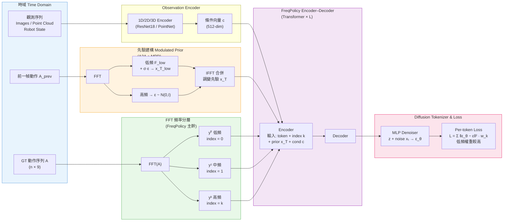

# Spectral-Adaptive Modulated Prior Diffusion

本專案實作了一套結合 **A2A (Action-to-Action)** 效率、**FreqPolicy** 物理連貫性，以及 **Modulated Prior** 數學框架的機器人控制策略。透過將動作空間轉移至頻域 (Frequency Domain)，我們實現了具備「肌肉記憶」且能即時反應的工業級控制。

---

## 核心創新：頻譜差異化調變 (Spectral-Selective Modulation)

本研究解決了傳統 A2A 在時域處理高頻噪音時導致的「過度平滑」問題。我們提出針對不同頻譜成分實施差異化策略：

* **低頻成分 (Low-Freq)**：動作的骨架與慣性。套用 **A2A + Modulated Prior**，實現 1-Step 高速推論。
* **高頻成分 (High-Freq)**：動作的修正與細節。維持 **Standard Diffusion Denoising**，保留機器人對動態環境的靈敏反應能力。

$$x_T = [\mu_{low} + \sigma_{low} \odot \epsilon_{low}, \epsilon_{high}]$$

---

## 系統運作閉環 (Time ↔ Frequency Domain Loop)

本系統的核心是一個時域與頻域之間的**完整閉環**：時域負責感知現實、執行動作；頻域負責決策運算、調變先驗。兩者透過 **FFT / IFFT** 橋接，缺一不可。

```
┌─────────────────────────────────────────────────────────────────┐
│                        完整控制閉環                               │
│                                                                  │
│   [ 時域 Time Domain ]          [ 頻域 Frequency Domain ]        │
│                                                                  │
│  觀測 oₜ (RGB/Joint)            FFT(Aₜ₋₁)                       │
│       │                         ├─ 低頻 F_low → 熱啟動先驗 xT   │
│  Obs Encoder                    │               (Modulated Prior)│
│       │                         └─ 高頻 F_high → ε ~ N(0,I)     │
│       ▼                                    │                     │
│  條件向量 c ──────────────────────────► FreqPolicy               │
│                                        Encoder-Decoder           │
│  Aₜ₋₁ (歷史動作) ──── FFT ──────────►   (Transformer)           │
│       ▲                                    │                     │
│       │                              迭代去噪 1~3步 (ODE)         │
│  RTDE 50Hz+                               │                     │
│  傳送至 UR 機器人                    IFFT ◄─┘                    │
│       ▲                                    │                     │
│       └──── Aₜ (時域動作序列) ◄────────────┘                     │
└─────────────────────────────────────────────────────────────────┘
```

| 階段 | 發生在 | 操作 | 技術來源 |
| :--- | :--- | :--- | :--- |
| **感知** | 時域 | 讀取 $o_t$、$A_{t-1}$ | — |
| **FFT 轉換** | 時域 → 頻域 | $F = \text{FFT}(A_{t-1})$ | FreqPolicy |
| **先驗建構** | 頻域 | 低頻熱啟動 + 高頻隨機 → $x_T$ | A2A + MPD |
| **頻率分層生成** | 頻域 | Transformer 迭代，k 層 token | FreqPolicy |
| **快速去噪** | 頻域 | 1~3 步 ODE（Flow Matching） | A2A |
| **IFFT 還原** | 頻域 → 時域 | $A_t = \text{IFFT}(C_t)$ | FreqPolicy |
| **執行** | 時域 | RTDE 50Hz+ 控制，$A_t$ 存回 $A_{t-1}$ | — |

---

## 技術基準對比 (Literature Review & Comparison)

本研究針對目前具身智能領域之兩大核心技術進行深入分析與對標。詳細的文獻探討與技術細節請參閱以下專題文件：

* [**Action-to-Action (A2A) Flow Matching**](./thesis/A2A.md)：探討知情初始化之效率優勢與時域過度平滑之局限性。
* [**Diffusion Policy 4 (DP4)**](./thesis/DP4.md)：分析潛在空間擴散之穩健性及其在工業級實時控制中之運算壓力。

---

## 支援環境與資料集 (Supported Benchmarks)

| 分類 | 名稱 | 測試重點 |
| :--- | :--- | :--- |
| **基礎驗證** | `PushT` | 2D 軌跡快速迭代 |
| **模仿學習** | `Robomimic` | 標準動作生成基準 |
| **工業大數據** | `Bridge V2` | 真實廚房多任務驗證 |
| **高頻控制** | `DROID` | 視覺引導與靈敏度測試 |
| **幾何精度** | `ManiSkill2` | 幾何精度與物理接觸細節 |
| **多任務通用** | `Meta-World` | 跨任務 (50種) 調變穩定性 |
| **靈巧手控制** | `Adroit` | 24 自由度高維度協調挑戰 |
| **通用大模型** | `Open X (RT-X)` | 跨機器人基礎模型泛化 |
| **數據增強** | `MimicGen` | 合成示範數據擴增實驗 |
| **實體落地** | `UR_Real_Data` | 實驗室 UR 機器人 RTDE 部署 |

---
## 實驗（預計）

本實驗設計圍繞三個核心假設展開：(1) 頻域先驗調變能在不犧牲準確性的前提下顯著提升推論速度；(2) 低高頻差異化策略比全頻統一策略具備更佳的動態反應能力；(3) SAMP-Diff 在物理平滑度指標上優於所有 baseline。

---
### Exp-1：頻率先驗的來源應該是什麼？（Frequency Prior Source）

**研究問題**：在頻域調變先驗中，不同頻率成分的「先驗資訊來源」應該是歷史動作、還是即時觀測？

#### 假說

低頻成分捕捉動作的全域結構，其跨幀變化緩慢，適合由 **歷史動作 $A_{t-1}$** 提供先驗；  
高頻成分對應即時的細微修正，其內容與當下視覺觀測高度相關，適合由 **當前 observation** 引導或直接設為自由雜訊。

#### 實驗設計

固定模型架構與訓練資料，只改變「各頻率 bin 的先驗來源」，比較以下三種策略：

| 方案 | 低頻先驗來源 | 高頻先驗來源 | 核心概念 |
| :--- | :--- | :--- | :--- |
| **方案 A**（A2A 原版） | $A_{t-1}$（歷史）| $A_{t-1}$（歷史）| 全頻都靠記憶 |
| **方案 B**（本研究）| $A_{t-1}$（歷史）| $\mathcal{N}(0,I)$（自由雜訊）| 低頻記憶 / 高頻自由 |
| **方案 C** | $A_{t-1}$（歷史）| 當前 obs 編碼 $z_t$ | 低頻記憶 / 高頻由視覺引導 |

#### 任務情境

兩種情境對照，讓先驗來源的差異能夠被明確放大：

- **情境一（慣性主導）**：`Robomimic Lift` — 動作平滑、無突發干擾，歷史先驗應有優勢
- **情境二（視覺主導）**：`PushT` 加入目標物隨機位移 — 需要即時修正，歷史先驗應出現劣勢

#### 評估指標

| 指標 | 說明 |
| :--- | :--- |
| Task Success Rate | 任務完成率，主要性能 |
| Frequency Band Error | 分別計算低頻 / 高頻係數的預測 MSE，觀察哪個頻段受益 |
| Action Jerk | 平滑度，衡量高頻先驗是否引入抖動 |
| Perturbation Recovery Time | 干擾發生後，幾幀內恢復正確軌跡（方案 B、C 應優於 A）|

## 模型流程 (Pipeline)

本架構以 **FreqPolicy** 為主幹，將 **A2A 熱啟動** 與 **Modulated Prior Diffusion** 整合進頻域流程。FFT 取代原版 DCT 作為頻率切割工具。

---

### 訓練流程 (Training Pipeline)



---

### 推論流程 (Inference Pipeline)

```mermaid
flowchart LR
    subgraph TIME2["時域 Time Domain"]
        direction TB
        OT["當前觀測 oₜ\nImages / Point Cloud\nRobot State"]
        AT_PREV["上一幀動作 A_prev"]
        ROBOT["UR 機器人\nRTDE 50Hz+"]
    end

    subgraph ENC2["Observation Encoder"]
        OT --> ENC_2["Encoder"]
        ENC_2 --> C2["條件向量 c"]
    end

    subgraph PRIOR3["FFT 熱啟動先驗\n(A2A + MPD)"]
        direction TB
        AT_PREV --> FFT3["FFT(A_prev)"]
        FFT3 --> LOW3["低頻 F_low\n+ σ·ε"]
        FFT3 --> HIGH3["高頻\n→ ε ~ N(0,I)"]
        LOW3 --> IFFT3["IFFT\n初始先驗 x_T"]
        HIGH3 --> IFFT3
    end

    subgraph ITER_BLOCK["迭代生成 Iter 1 → N_iter\n(FreqPolicy Sampling)"]
        direction TB
        ITER_IN["輸入: x_T + masked tokens\nindex = l₀ (低頻起點)"]
        ENC_I2["FreqPolicy Encoder"]
        DEC_I2["FreqPolicy Decoder"]
        ODE["Flow Matching ODE\n1~3 步去噪"]
        IFFT_I2["IFFT → k-level token\n更新 index → lᵢ₊₁"]
        ITER_IN --> ENC_I2 --> DEC_I2 --> ODE --> IFFT_I2
        IFFT_I2 -->|"重複 N_iter 次\n頻率逐步提升"| ENC_I2
    end

    subgraph OUT_BLOCK["輸出還原"]
        direction TB
        FULL2["全頻 token (Full-frequency)"]
        IFFT_OUT2["IFFT → 時域動作 Aₜ\n(n × 9)"]
        FULL2 --> IFFT_OUT2
    end

    C2 --> ITER_IN
    IFFT3 --> ITER_IN
    IFFT_I2 --> FULL2
    IFFT_OUT2 --> ROBOT
    IFFT_OUT2 -->|"存為 A_prev\nA2A 閉環"| AT_PREV

    style TIME2 fill:#e8f4fd,stroke:#4a90d9
    style PRIOR3 fill:#fff3e0,stroke:#f5a623
    style ITER_BLOCK fill:#f3e5f5,stroke:#9c27b0
    style OUT_BLOCK fill:#e8f8e8,stroke:#4caf50
```



---

### 三大技術整合說明

| 技術來源 | 整合位置 | 作用 |
| :--- | :--- | :--- |
| **Modulated Prior Diffusion** | 先驗建構（PRIOR 區塊）| 以 $A_{t-1}$ 低頻係數作為先驗均值，取代純高斯起點 |
| **A2A Flow Matching** | 熱啟動先驗 + ODE 去噪 | 低頻熱啟動 + 1~3 步 ODE，取代 50 步標準去噪 |
| **FreqPolicy（主幹）** | Encoder–Decoder + 迭代生成 | FFT 切割頻率層、Transformer 編解碼、per-token diffusion loss |

---


## 設計哲學：為什麼要這樣做？ (Design Philosophy)

### 1. 解決「延遲」
利用 **A2A** 知情初始化配合 **Modulated Prior**，將推論步數壓縮至 **1-3 步**，解決標準 Diffusion 運算過慢之痛點。

### 2. 解決「抖動」
在頻域生成動作等於是在底層進行物理級的「低通濾波」，從數學本質上確保產出軌跡的連貫性與絲滑度。

### 3. 解決「反應遲鈍」
透過**頻譜差異化**策略，使低頻（大方向）靠記憶維持穩定，高頻（細微修正）由當前視覺感官引導去噪，讓機器人兼具肌肉記憶與靈敏反應。
