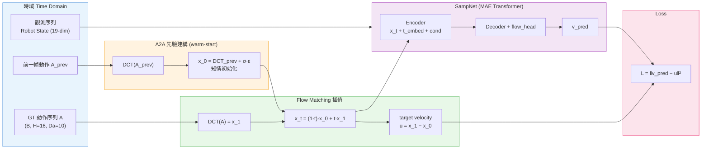
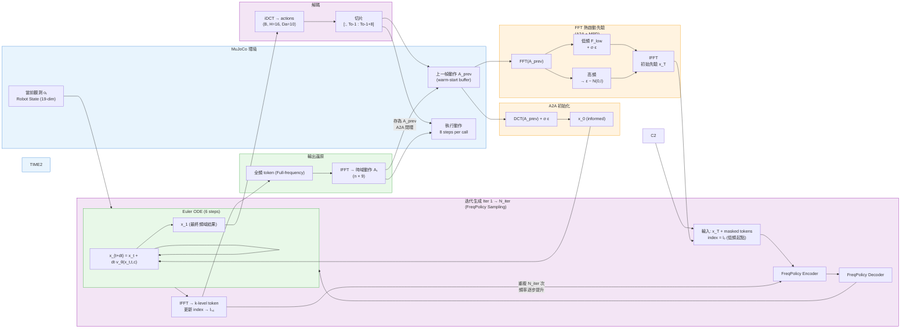

ㄏ2A 熱啟動** 與 **Modulated Prior** 整合進頻域流程。DCT 作為頻率切割工具（後續版本預計升級為 FFT 分離高低頻）。

---

### 訓練流程圖 (Training Pipeline)

---

### 推論流程圖 (Inference Pipeline)

---

### 三大技術整合說明

| 技術來源 | 整合位置 | 作用 |
| :--- | :--- | :--- |
| **Modulated Prior Diffusion** | 先驗建構（PRIOR 區塊）| 以 $A_{t-1}$ 低頻係數作為先驗均值，取代純高斯起點 |
| **A2A Flow Matching** | 熱啟動先驗 + ODE 去噪 | 低頻熱啟動 + 1~3 步 ODE，取代 50 步標準去噪 |
| **FreqPolicy（主幹）** | Encoder–Decoder + 迭代生成 | FFT 切割頻率層、Transformer 編解碼、per-token diffusion loss |

---

## 設計哲學：為什麼要這樣做？ (Design Philosophy)

### 1. 解決「延遲」
利用 **A2A** 知情初始化配合 **Modulated Prior**，將推論步數壓縮至 **1-3 步**，解決標準 Diffusion 運算過慢之痛點。

### 2. 解決「抖動」
在頻域生成動作等於是在底層進行物理級的「低通濾波」，從數學本質上確保產出軌跡的連貫性與絲滑度。

### 3. 解決「反應遲鈍」
透過**頻譜差異化**策略，使低頻（大方向）靠記憶維持穩定，高頻（細微修正）由當前視覺感官引導去噪，讓機器人兼具肌肉記憶與靈敏反應。
