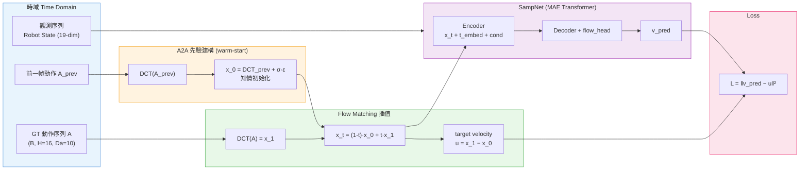
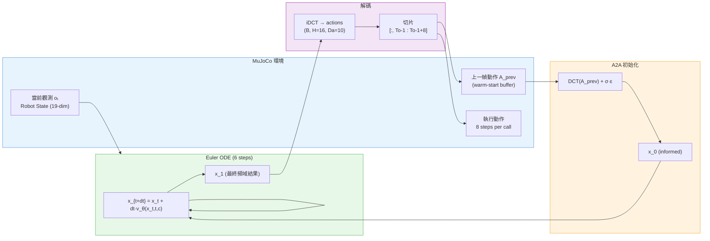

# Spectral-Adaptive Modulated Prior Diffusion

本專案實作了一套結合 **A2A (Action-to-Action)** 效率、**FreqPolicy** 物理連貫性，以及 **Modulated Prior** 數學框架的機器人控制策略。透過將動作空間轉移至頻域 (Frequency Domain)，我們實現了具備「肌肉記憶」且能即時反應的工業級控制。

---

## 核心創新：頻譜差異化調變 (Spectral-Selective Modulation)

本研究解決了傳統 A2A 在時域處理高頻噪音時導致的「過度平滑」問題。我們提出針對不同頻譜成分實施差異化策略：

* **低頻成分 (Low-Freq)**：動作的骨架與慣性。套用 **A2A + Modulated Prior**，實現 1-Step 高速推論。
* **高頻成分 (High-Freq)**：動作的修正與細節。維持 **Standard Diffusion Denoising**，保留機器人對動態環境的靈敏反應能力。

$$x_T = [\mu_{low} + \sigma_{low} \odot \epsilon_{low}, \epsilon_{high}]$$

---

## 系統運作閉環 (Time ↔ Frequency Domain Loop)

本系統的核心是一個時域與頻域之間的**完整閉環**：時域負責感知現實、執行動作；頻域負責決策運算、調變先驗。兩者透過 **FFT / IFFT** 橋接，缺一不可。

```
┌───────────────────────────────────────────────────────────────── ┐
│                        完整控制閉環                               │
│                                                                  │
│   [ 時域 Time Domain ]          [ 頻域 Frequency Domain ]         │
│                                                                  │
│  觀測 oₜ (RGB/Joint)            FFT(Aₜ₋₁)                          │
│       │                         ├─ 低頻 F_low → 熱啟動先驗 xT      │
│  Obs Encoder                    │               (Modulated Prior) │
│       │                         └─ 高頻 F_high → ε ~ N(0,I)        │
│       ▼                                    │                      │
│  條件向量 c ──────────────────────────► FreqPolicy                │
│                                        Encoder-Decoder           │
│  Aₜ₋₁ (歷史動作) ──── FFT ──────────►   (Transformer)              │
│       ▲                                    │                     │
│       │                              迭代去噪 1~3步 (ODE)         │
│  RTDE 50Hz+                               │                      │
│  傳送至 UR 機器人                    IFFT ◄─┘                     │
│       ▲                                    │                     │
│       └──── Aₜ (時域動作序列) ◄────────────┘                       │
└─────────────────────────────────────────────────────────────── ──┘
```

| 階段 | 發生在 | 操作 | 技術來源 |
| :--- | :--- | :--- | :--- |
| **感知** | 時域 | 讀取 $o_t$、$A_{t-1}$ | — |
| **FFT 轉換** | 時域 → 頻域 | $F = \text{FFT}(A_{t-1})$ | FreqPolicy |
| **先驗建構** | 頻域 | 低頻熱啟動 + 高頻隨機 → $x_T$ | A2A + MPD |
| **頻率分層生成** | 頻域 | Transformer 迭代，k 層 token | FreqPolicy |
| **快速去噪** | 頻域 | 1~3 步 ODE（Flow Matching） | A2A |
| **IFFT 還原** | 頻域 → 時域 | $A_t = \text{IFFT}(C_t)$ | FreqPolicy |
| **執行** | 時域 | RTDE 50Hz+ 控制，$A_t$ 存回 $A_{t-1}$ | — |

---

## 技術基準對比 (Literature Review & Comparison)

本研究針對目前具身智能領域之兩大核心技術進行深入分析與對標。詳細的文獻探討與技術細節請參閱以下專題文件：

* [**Action-to-Action (A2A) Flow Matching**](./thesis/A2A.md)：探討知情初始化之效率優勢與時域過度平滑之局限性。
* [**Diffusion Policy 4 (DP4)**](./thesis/DP4.md)：分析潛在空間擴散之穩健性及其在工業級實時控制中之運算壓力。

---

## 支援環境與資料集 (Supported Benchmarks)

| 分類 | 名稱 | 測試重點 |
| :--- | :--- | :--- |
| **基礎驗證** | `PushT` | 2D 軌跡快速迭代 |
| **模仿學習** | `Robomimic` | 標準動作生成基準 |
| **工業大數據** | `Bridge V2` | 真實廚房多任務驗證 |
| **高頻控制** | `DROID` | 視覺引導與靈敏度測試 |
| **幾何精度** | `ManiSkill2` | 幾何精度與物理接觸細節 |
| **多任務通用** | `Meta-World` | 跨任務 (50種) 調變穩定性 |
| **靈巧手控制** | `Adroit` | 24 自由度高維度協調挑戰 |
| **通用大模型** | `Open X (RT-X)` | 跨機器人基礎模型泛化 |
| **數據增強** | `MimicGen` | 合成示範數據擴增實驗 |
| **實體落地** | `UR_Real_Data` | 實驗室 UR 機器人 RTDE 部署 |

---
## 實驗（預計）

本實驗設計圍繞三個核心假設展開：(1) 頻域先驗調變能在不犧牲準確性的前提下顯著提升推論速度；(2) 低高頻差異化策略比全頻統一策略具備更佳的動態反應能力；(3) SAMP-Diff 在物理平滑度指標上優於所有 baseline。

---
### Exp-1：頻率先驗的來源應該是什麼？（Frequency Prior Source）

**研究問題**：在頻域調變先驗中，不同頻率成分的「先驗資訊來源」應該是歷史動作、還是即時觀測？

#### 假說

低頻成分捕捉動作的全域結構，其跨幀變化緩慢，適合由 **歷史動作 $A_{t-1}$** 提供先驗；  
高頻成分對應即時的細微修正，其內容與當下視覺觀測高度相關，適合由 **當前 observation** 引導或直接設為自由雜訊。

#### 實驗設計

固定模型架構與訓練資料，只改變「各頻率 bin 的先驗來源」，比較以下三種策略：

| 方案 | 低頻先驗來源 | 高頻先驗來源 | 核心概念 |
| :--- | :--- | :--- | :--- |
| **方案 A**（A2A 原版） | $A_{t-1}$（歷史）| $A_{t-1}$（歷史）| 全頻都靠記憶 |
| **方案 B**（本研究）| $A_{t-1}$（歷史）| $\mathcal{N}(0,I)$（自由雜訊）| 低頻記憶 / 高頻自由 |
| **方案 C** | $A_{t-1}$（歷史）| 當前 obs 編碼 $z_t$ | 低頻記憶 / 高頻由視覺引導 |

#### 任務情境

兩種情境對照，讓先驗來源的差異能夠被明確放大：

- **情境一（慣性主導）**：`Robomimic Lift` — 動作平滑、無突發干擾，歷史先驗應有優勢
- **情境二（視覺主導）**：`PushT` 加入目標物隨機位移 — 需要即時修正，歷史先驗應出現劣勢

#### 評估指標

| 指標 | 說明 |
| :--- | :--- |
| Task Success Rate | 任務完成率，主要性能 |
| Frequency Band Error | 分別計算低頻 / 高頻係數的預測 MSE，觀察哪個頻段受益 |
| Action Jerk | 平滑度，衡量高頻先驗是否引入抖動 |
| Perturbation Recovery Time | 干擾發生後，幾幀內恢復正確軌跡（方案 B、C 應優於 A）|

## SAMP_Diff_v1 架構 (v1 現行實作)

SAMP_Diff_v1 為已落地之第一版實作。採 **DCT（全頻）** 取代 FFT，**Flow Matching** 取代 DDPM，並加入 **A2A warm-start** 先驗初始化。高低頻分離策略留待 v2 實作。

| 項目 | **v1 當前 (SAMP_Diff_v1)** | **目標 v2** |
| :--- | :--- | :--- |
| 頻率工具 | DCT（全頻一致） | FFT（高 / 低頻分離） |
| 損失函數 | Flow Matching MSE | FM + per-band weighted loss |
| warm-start 先驗 | DCT(A_prev) + σ·ε（全頻） | 低頻 DCT warm-start；高頻 → N(0,I) |
| 推論步數 | 6 步 Euler ODE | 1~3 步 ODE |
| 模擬環境 | MuJoCo (robomimic Lift) | MuJoCo + Real UR |

---

### 訓練流程圖 (Training Pipeline)



---

### 推論流程圖 (Inference Pipeline)



---

### 三大技術整合說明

| 技術來源 | 整合位置 | 作用 |
| :--- | :--- | :--- |
| **Modulated Prior Diffusion** | 先驗建構（PRIOR 區塊）| 以 $A_{t-1}$ 頻域係數作為先驗均值，取代純高斯起點 |
| **A2A Flow Matching** | 熱啟動先驗 + ODE 去噪 | warm-start 初始化 + 6 步 Euler ODE，取代 50 步標準去噪 |
| **FreqPolicy（主幹）** | Encoder–Decoder + 頻域生成 | DCT 切割頻率、MAE Transformer 編解碼、FM velocity loss |

---

## 設計哲學：為什麼要這樣做？ (Design Philosophy)

### 1. 解決「延遲」
利用 **A2A** 知情初始化配合 **Modulated Prior**，將推論步數壓縮至 **1-6 步**，解決標準 Diffusion 運算過慢之痛點。

### 2. 解決「抖動」
在頻域生成動作等於是在底層進行物理級的「低通濾波」，從數學本質上確保產出軌跡的連貫性與絲滑度。

### 3. 解決「反應遲鈍」
透過 **A2A warm-start** 策略（v1）以及未來的**頻譜差異化**策略（v2），使低頻（大方向）靠記憶維持穩定，讓機器人兼具肌肉記憶與靈敏反應。

---
## SAMP_Diff_v1 使用說明


本節說明 `SAMP_Diff_v1/` 程式碼的**安裝、訓練、與推論（執行）**流程。  
訓練與推論為完全獨立的兩個階段，可分別操作。

---

### 環境安裝

```bash
cd SAMP_Diff_v1
conda env create -f conda_environment.yaml
conda activate robodiff
pip install -e .
pip install torchcfm torch-dct
```

> **模擬後端**：預設使用 **MuJoCo**（透過 robomimic 環境）。  
> 需要 MuJoCo 授權並完成 [robomimic 資料集下載](https://robomimic.github.io/docs/datasets/robomimic_v0.1.html)。

---

### 一、訓練流程 (Training)

#### 1. 準備資料集

```
SAMP_Diff_v1/
└── data/
    └── robomimic/
        └── datasets/
            └── lift/
                └── ph/
                    └── low_dim_abs.hdf5   ← robomimic lift (proficient human)
```

下載指令（需安裝 robomimic）：

```bash
python -m robomimic.scripts.download_datasets \
    --tasks lift --dataset_types ph --hdf5_types low_dim
```

#### 2. 啟動訓練

```bash
# MuJoCo — robomimic Lift (預設/推薦)
python train.py --config-name=lift_ph

# 2-D baseline：PushT
python train.py --config-name=pusht

# 常用覆蓋參數
python train.py --config-name=lift_ph \
    training.device=cuda:1 \
    dataloader.batch_size=128 \
    training.num_epochs=1000
```

#### 3. 訓練流程說明

```
資料集 (HDF5)
    │  RobomimicReplayLowdimDataset
    │  obs_keys: object, eef_pos, eef_quat(rot6d), gripper_qpos
    ▼
正規化  LinearNormalizer  [-1, 1]
    │
    ├─ obs  (B, To=2, obs_dim=19)  ──────► global_cond (B, 38)
    └─ action (B, H=16, Da=10)
         │
         ├─ x_1 = DCT(action)              ← 頻域目標
         └─ x_0 = DCT(prev_action) + σ·ε  ← A2A warm-start 先驗
              │
              ▼
    Flow Matching 插值
    x_t = (1-t)·x_0 + t·x_1 + noise
              │
              ▼
    SampNet (MAE Transformer)
    velocity_fn(x_t, t, global_cond)
    → v_pred
              │
              ▼
    Loss = ‖v_pred − (x_1 − x_0)‖²
```

#### 4. 訓練輸出

```
data/outputs/samp_lowdim_lift_ph/
├── checkpoints/
│   ├── latest.ckpt          ← 最新 checkpoint
│   └── epoch=xxxx-test_mean_score=x.xxx.ckpt
├── logs.json.txt
└── wandb/
```

---

### 二、推論 / 執行流程 (Inference / Evaluation)

#### 1. 在 MuJoCo 模擬中評估

```bash
python eval.py \
    --checkpoint data/outputs/samp_lowdim_lift_ph/checkpoints/latest.ckpt \
    --output_dir data/eval_output/lift_ph \
    --device cuda:0
```

#### 2. 推論流程說明

```
checkpoint (latest.ckpt)
    │  載入 cfg + model weights
    ▼
SampLowdimPolicy.predict_action(obs_dict)
    │
    ├─ 第一幀:  x_0 ~ N(0, I)
    └─ 後續幀:  x_0 = DCT(self._prev_action) + σ·ε   ← A2A warm-start
                    │
                    ▼
             Euler ODE (6 steps)
             x_{t+dt} = x_t + dt · v_θ(x_t, t, obs_cond)
                    │
                    ▼
             x_1 → iDCT → actions (B, H=16, Da=10)
                    │
                    ▼
             取 actions[:, To-1 : To-1+n_action_steps]
             = 本幀執行的 8 個動作步驟
                    │
                    ▼
             self._prev_action = actions (存回，供下幀 warm-start)
```

#### 3. 呼叫週期（部署時）

```
While episode_not_done:
    obs_dict = env.get_obs()          # 取得當前觀測
    result   = policy.predict_action(obs_dict)
    action   = result['action']       # (B=1, 8, 10)
    env.step(action[0])               # 執行 8 步
    # 下一次呼叫自動使用 warm-start
```

> **重置**：切換 episode 前呼叫 `policy.reset()` 清除 warm-start buffer。

#### 4. 評估輸出

```
data/eval_output/lift_ph/
├── eval_log.json      ← test/mean_score, train/mean_score 等
└── media/             ← 錄影片段（.mp4）
```
